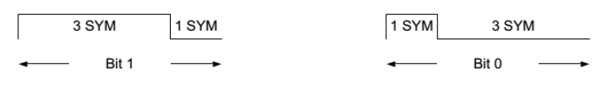
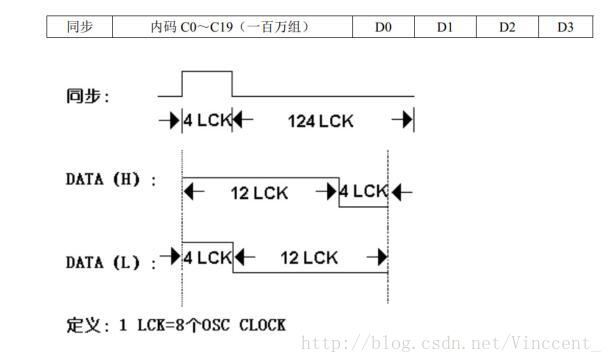
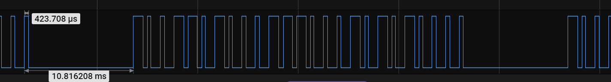
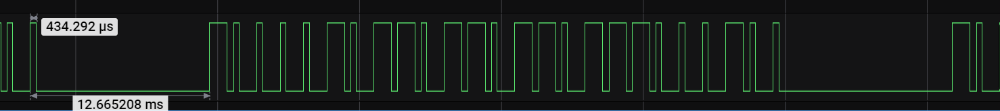

# EV1527 解码
## 接收硬件
1. 315/433 接收模块:SYN470R SYN480R
2. 315/433 遥控器
3. 解码mcu:stm32f103

## EV1527 数据据帧结构
无线遥控的编码，从编码类型上来说，分为2类，一类是固定码，也就是编码芯片的地址是不变的，芯片型号以 EV1527、PT2262 为代表。另一种是滚动码，芯片的地址码是变化的，芯片以HS300、HS301为代表
1. E527编码,每个数据位由4个单位时间组成
     
2. EV1527 每帧数据由 24 个数据位组成，前 20 位为地址码,每个芯片的地址码是唯一的。后面 4 位为按键码，对应芯片上的K0-K3 4 根数据线
3. 在数据位之前，有一个同步脉冲，数据位的“1”和“0”是由高低电平宽度（脉冲宽度）的比例决定的。如果高电平宽度为低电平宽度的 3 倍，就表示逻辑“1”，反过来如果低电平为高电平宽度的 3 倍，就表示逻辑“0”。同步脉冲高电平和低电平的比例固定为 4：124.
     
    315M 
    433M 

## 解码
用IO中断加定时器方式解码
IO用双边缘触发,定时器设到1us计数
当中断触发时,读取定时器的计数,即可得到高电平或者低电平的脉冲宽度
解码部份移自https://www.github.com/NimaLTD,但似乎原有的解码程序有问题,无法获得正确的值,故修改了中断及解码处理部份

## 测试
测试315M/433的遥控器,接收正常

## 兼容芯片
CMT2150L/EV1527

